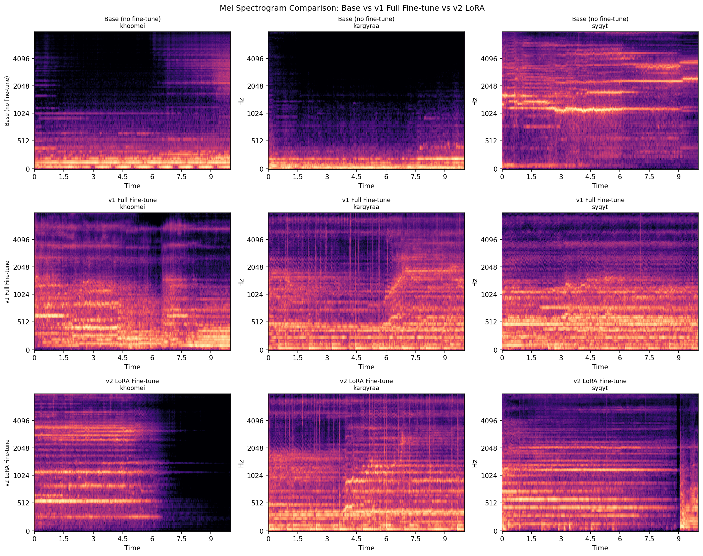

# MetalThroat

Fine-tuning Meta's MusicGen on Mongolian and Tuvan throat singing — khoomei, sygyt, kargyraa. A case study in low-resource domain adaptation for generative audio.



---

## What this is

MusicGen can generate a convincing jazz piano solo in seconds. Ask it for Mongolian throat singing and you get noise — these styles barely exist in its training data. This project fine-tunes MusicGen-small (300M parameters) on a self-built 11-hour dataset scraped from YouTube, and documents two attempts: full fine-tuning (which overfit badly) and LoRA adaptation (which worked).

The repo covers the full pipeline: data collection, training, inference, and evaluation — including the bugs, the dead ends, and the reasoning behind each decision.

---

## Listen

Click any link to open GitHub's audio player. Three styles, three models — base MusicGen (untrained), v1 full fine-tune, v2 LoRA.

| Style | Base | v1 Full FT | v2 LoRA |
|---|---|---|---|
| Khoomei | [▶ base](evaluation_lora/base_khoomei.wav) | [▶ v1](evaluation_lora/v1_khoomei.wav) | [▶ lora](evaluation_lora/lora_khoomei.wav) |
| Kargyraa | [▶ base](evaluation_lora/base_kargyraa.wav) | [▶ v1](evaluation_lora/v1_kargyraa.wav) | [▶ lora](evaluation_lora/lora_kargyraa.wav) |
| Sygyt | [▶ base](evaluation_lora/base_sygyt.wav) | [▶ v1](evaluation_lora/v1_sygyt.wav) | [▶ lora](evaluation_lora/lora_sygyt.wav) |

---

## Results

|  | Best Val Loss | Train/Val Gap | Trainable Params | Checkpoint Size |
|---|---|---|---|---|
| Base MusicGen | — | — | 0 | — |
| v1 Full Fine-tune | 2.564 | ~1.0 nats | 300M | 1.6 GB |
| **v2 LoRA** | **2.596** | **~0.42 nats** | **44M (10.5%)** | **176 MB** |

Harmonic ratio (fraction of audio energy that is tonal; higher = better):

|  | Khoomei | Kargyraa | Sygyt |
|---|---|---|---|
| Base MusicGen | 0.941 | 0.865 | 0.953 |
| v1 Full Fine-tune | 0.828 | 0.801 | 0.779 |
| **v2 LoRA** | **0.951** | **0.837** | **0.874** |

LoRA achieved 4× less overfitting than full fine-tuning, a 9× smaller checkpoint, and better harmonic quality across all three styles.

---

## Samples

Click any file to open GitHub's audio player.

**Best outputs (15s each)**

| Style | Base MusicGen | v1 Full Fine-tune | v2 LoRA |
|---|---|---|---|
| Khoomei | [▶ base](evaluation_lora/base_khoomei.wav) | [▶ v1](evaluation_lora/v1_khoomei.wav) | [▶ lora](evaluation_lora/lora_khoomei.wav) |
| Kargyraa | [▶ base](evaluation_lora/base_kargyraa.wav) | [▶ v1](evaluation_lora/v1_kargyraa.wav) | [▶ lora](evaluation_lora/lora_kargyraa.wav) |
| Sygyt | [▶ base](evaluation_lora/base_sygyt.wav) | [▶ v1](evaluation_lora/v1_sygyt.wav) | [▶ lora](evaluation_lora/lora_sygyt.wav) |

**[▶ 30-second showcase](samples_lora/showcase_30s.wav)** — best style, best inference params

---

## Architecture

```
Text prompt → T5 encoder (frozen) → Transformer LM (LoRA adapters trained) → EnCodec (frozen) → Audio
```

MusicGen tokenizes audio via EnCodec (~50 tokens/sec, 4 codebooks × 2048 vocab). Each 10-second training clip becomes ~2,000 discrete tokens. Only the Transformer LM is adapted; T5 and EnCodec stay frozen throughout.

**LoRA config:** r=128, alpha=256, dropout=0.05, targeting `out_proj` + `linear1` + `linear2` across all 24 transformer layers (~44M trainable / 420M total).

---

## Dataset

Built from YouTube using `yt-dlp` + `ffmpeg`. Segmented into 10-second clips at 32kHz.

| Split | Clips | Duration |
|---|---|---|
| Train | 3,546 | ~9.9 hrs |
| Val | 393 | ~1.1 hrs |

Three styles, kept separate because MusicGen is text-conditioned — each style needs its own prompt so the model can learn to steer toward the right acoustic character at inference time.

- **Khoomei** — harmonic overtone singing with a drone bass
- **Kargyraa** — deep, guttural, subharmonic rumble
- **Sygyt** — high-pitched, flute-like overtone melody

---

## Quickstart

```bash
# Install dependencies (CUDA 12.8 / RTX 4090+)
pip install torch torchvision torchaudio --index-url https://download.pytorch.org/whl/cu128
pip install -r requirements.txt

# Older GPUs (CUDA 12.1)
pip install torch torchvision torchaudio --index-url https://download.pytorch.org/whl/cu121
pip install -r requirements.txt
```

### Run notebooks in order

```bash
jupyter notebook
```

| Notebook | Purpose |
|---|---|
| `01_setup_and_inference.ipynb` | Validate environment, generate baseline samples from unmodified MusicGen |
| `02_data_preparation.ipynb` | Download YouTube audio, segment clips, build dataset manifests |
| `03_finetuning.ipynb` | Full fine-tuning (v1) — trains the LM on throat singing data |
| `04_evaluation.ipynb` | Compare base vs fine-tuned outputs |
| `05_lora_evaluation.ipynb` | 3-way comparison: base vs v1 vs v2 LoRA |

### Or run the LoRA pipeline directly

```bash
# Train (60 epochs, early stopping, ~7 min/epoch on RTX 5090)
python 05_train_lora.py

# Generate showcase samples
python 06_generate_samples_lora.py

# Generate showcase visualizations for the portfolio page
python generate_showcase_viz.py
```

---

## Key Implementation Notes

**No mixed precision.** `torch.autocast` with bfloat16 triggers a silent dtype mismatch in audiocraft 1.3.0 that produces NaN loss with no error message. The model runs in float32 throughout.

**`nan_to_num` before cross-entropy.** MusicGen's codebook delay pattern produces NaN logits for the first K positions of codebook K. The training mask zeros these out — but `NaN × 0 = NaN` in IEEE 754. Fix: `logits.nan_to_num(nan=0.0)` before the loss computation.

**Manual LoRA, not HuggingFace PEFT.** PEFT wraps `model.lm` in a `PeftModel` class that doesn't expose `compute_predictions()` — the method MusicGen's entire inference pipeline calls. A custom `LoRALinear` + `inject_lora()` (~150 lines in `lora_utils.py`) keeps the interface intact.

**QKV is not targetable.** MusicGen fuses query/key/value into a single raw `nn.Parameter` (`in_proj_weight`), not separate `nn.Linear` layers. Standard LoRA targets (`q_proj`, `k_proj`, `v_proj`) don't exist. Adapters target `out_proj`, `linear1`, `linear2` instead.

---

## Repo Structure

```
├── 01_setup_and_inference.ipynb
├── 02_data_preparation.ipynb
├── 03_finetuning.ipynb
├── 04_evaluation.ipynb
├── 05_train_lora.py
├── 05_lora_evaluation.ipynb
├── 06_generate_samples_lora.py
├── generate_showcase_viz.py       # generates showcase/ PNGs
├── lora_utils.py                  # LoRALinear, inject_lora, checkpoint utils
├── recover_state.py               # rebuild best_checkpoint.pt from epoch files
├── continue_training.py           # resume v1 training from latest checkpoint
├── dataset/
│   ├── train.jsonl
│   └── val.jsonl
├── checkpoints/                   # v1 full fine-tune checkpoints (not committed)
├── checkpoints_lora/              # v2 LoRA adapter checkpoints (not committed)
├── evaluation_lora/               # 9 comparison WAVs + spectrograms + feature plots
├── samples_lora/                  # best generated samples per style
└── showcase/                      # training curve plots + metrics table (generated)
```

---

## Training Configuration

| Parameter | v1 Full FT | v2 LoRA |
|---|---|---|
| Learning rate | 1e-5 | 3e-4 |
| Batch size | 4 | 4 |
| Optimizer | AdamW | AdamW |
| Scheduler | CosineAnnealingLR | CosineAnnealingLR + warmup |
| Epochs | 30 | 60 (stopped at 57) |
| Early stopping patience | 10 | 15 |
| Augmentation | None | Pitch shift ±2 semitones (30%) |
| Precision | float32 | float32 |

---

## License

MIT
